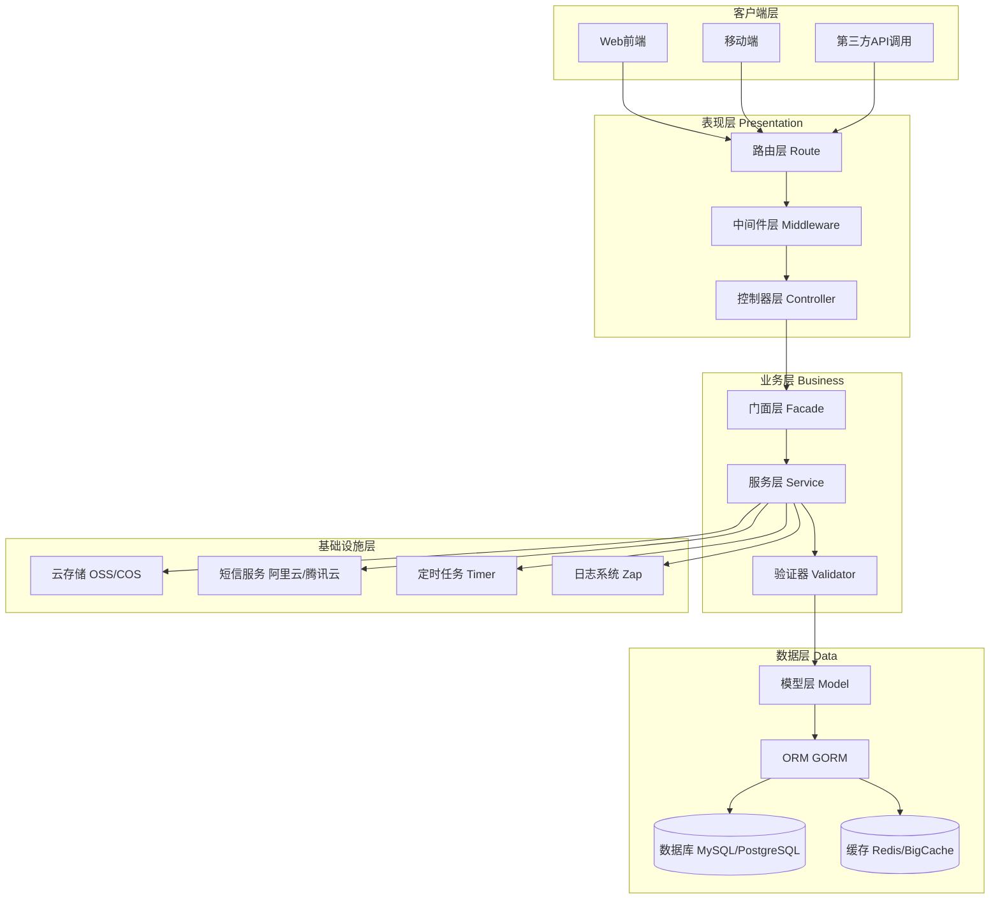
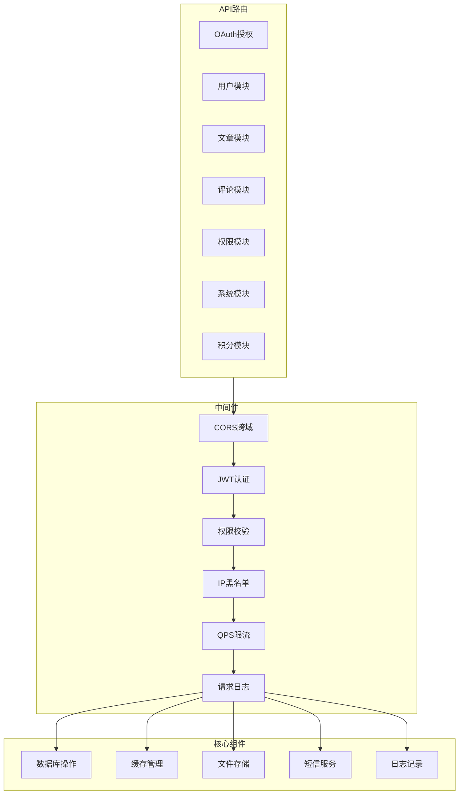

# inis

inis 是一款基于 Go 语言开发的高性能内容管理系统（CMS），基于 Gin 框架二次开发，采用 Gorm 作为数据库 ORM 工具，设计风格参考 ThinkPHP 6 的简洁架构理念。系统以 "轻量核心、高效响应、灵活扩展" 为核心定位，致力于为开发者提供易上手、具备良好扩展基础的 CMS 解决方案，同时满足企业级应用的性能与安全需求。

## 核心特性

- 🚀 **高性能**：基于 Go 语言和 Gin 框架，提供毫秒级响应能力
- 🔒 **安全可靠**：多层安全防护机制，包括安装锁、API 签名、QPS 限流、SQL 注入防护（ORM参数化查询）、XSS 防护（bluemonday HTML过滤）、CSRF 防护等
- 📦 **轻量灵活**：简洁的架构设计，易于理解和扩展
- 🌍 **国际化**：内置多语言支持，方便全球化部署
- 💾 **高效缓存**：智能缓存策略，提升数据查询效率

### 性能数据（预留）

| 指标 | 数值 | 测试环境 | 备注 |
|------|------|----------|------|
| QPS（查询接口） | - | - | 待压测 |
| QPS（写入接口） | - | - | 待压测 |
| 平均响应时间 | - | - | 待压测 |
| P99响应时间 | - | - | 待压测 |

## 快速开始
后端主程序开源仓库：[inisv1](https://github.com/zhu885744/inisv1)<br>
默认主题Github开源仓库：[xiao-inisv1-vue](https://github.com/zhu885744/xiao-inisv1-vue)

### 开发环境运行
#### 步骤 1：安装依赖
1. 安装 [Go](https://golang.org/dl/) 1.24.0+ 版本
2. 克隆项目代码：
   ```bash
   git clone https://github.com/zhu885744/inisv1.git
   cd inisv1
   ```
3. 安装项目依赖：
   ```bash
   go mod tidy
   ```

#### 步骤 2：运行项目
```bash
go run main.go
```

> 访问地址：http://localhost:8642 后会显示图形化安装程序操作页面根据提示进行安装
> 默认管理员账号：admin
> 默认管理员密码：admin123456

### 打包教程

#### 使用 build.bat 脚本（推荐）
1. 在项目根目录下双击 `build.bat` 文件
2. 根据提示选择编译平台（Windows/Linux/macOS）
3. 等待编译完成，生成的可执行文件会放在 `dist` 目录

#### 手动打包

##### Windows 平台
```bash
# 编译为可执行文件
go build -o inis.exe main.go

# 后台运行版本（无控制台窗口）
go build -ldflags -H=windowsgui -o inis.exe main.go
```

##### Linux 平台
```bash
# 编译为可执行文件
go build -o inis main.go

# 设置可执行权限
chmod +x inis
```

##### 使用 bee 工具打包
```bash
# 安装 bee 工具
go get github.com/beego/bee

# 打包为 Windows 后台运行版本
bee pack -ba="-ldflags -H=windowsgui"

# 打包为 Linux 版本
bee pack -ba="-ldflags -s -w"
```

### 服务器环境推荐
- **操作系统**：Debian 12 / Ubuntu Server 22.04 /
- **CPU**：2 核及以上
- **内存**：2GB 及以上
- **存储**：10GB SSD
- **网络**：5Mbps 及以上带宽

### 常见部署问题

| 问题 | 原因 | 解决方案 |
|------|------|----------|
| 端口被占用 | 8642 端口已被其他服务占用 | 修改 `config/app.toml` 中的端口配置 |
| 数据库连接失败 | 数据库配置错误 | 检查数据库连接信息和权限 |
| 404 错误 | 主题文件未部署 | 确保主题文件已正确部署到 `public` 目录 |
| 502 错误 | 应用未运行或端口错误 | 检查应用运行状态和 Nginx 配置 |

> 系统默认提供一个默认主题，内置完整的管理后台
> Github开源仓库：[xiao-inisv1-vue](https://github.com/zhu885744/xiao-inisv1-vue)

## 系统架构

### 技术栈

| 分类 | 技术 | 版本 | 说明 |
|------|------|------|------|
| **编程语言** | Go (Golang) | 1.25.0 | 后端服务主语言 |
| **Web框架** | Gin | 1.12.0 | 高性能 HTTP 请求处理框架 |
| **ORM** | GORM | 1.31.2 | 数据库 ORM 框架 |
| **数据库** | MySQL / PostgreSQL | - | 关系型数据库（ORM层支持多数据库，当前默认MySQL） |
| **数据库驱动** | go-sql-driver/mysql | 1.8.1 | MySQL 数据库驱动 |
| **缓存** | Redis | v9.21.0 | 分布式缓存 |
| **本地缓存** | BigCache | v3.1.0 | 高性能本地缓存 |
| **JWT** | golang-jwt/jwt | v5.3.1 | JSON Web Token 认证 |
| **HTML过滤** | bluemonday | v1.0.27 | HTML 内容安全过滤 |
| **安全中间件** | unrolled/secure | v1.17.0 | HTTP 安全头设置 |
| **WebSocket** | gorilla/websocket | v1.5.3 | 实时双向通信 |
| **定时任务** | gocron | v0.0.1 | 定时任务调度 |
| **配置管理** | Viper | v1.17.0 | 配置文件管理（支持 TOML） |
| **日志框架** | Zap | v1.28.0 | 高性能结构化日志 |
| **日志轮转** | lumberjack | v2.0.0 | 日志文件轮转 |
| **阿里云短信** | darabonba-openapi + tea | v2.2.3/v1.5.2 | 短信发送服务 |
| **阿里云 OSS** | aliyun-oss-go-sdk | v3.0.2 | 对象存储 |
| **腾讯云短信** | tencentcloud-sdk-go | v1.3.125 | 短信发送服务 |
| **腾讯云 COS** | cos-go-sdk-v5 | v0.7.74 | 对象存储 |
| **通用工具** | go-utils | v1.3.1 | 常用工具函数（模块路径迁移中） |
| **类型转换** | cast | v1.10.0 | 类型转换工具 |
| **UUID** | google/uuid | v1.6.0 | UUID 生成 |
| **图片处理** | imaging | v1.6.2 | 图片裁剪、缩放 |
| **数据验证** | go-playground/validator | v10.30.1 | 请求参数验证 |
| **配置监听** | fsnotify | v1.10.1 | 配置文件热更新 |
| **邮件发送** | gomail | v2.0.0 | 邮件发送 |
| **系统信息** | gopsutil | v3.21.11 | 系统资源监控 |
| **GORM插件** | gorm.io/plugin/soft_delete | v1.2.1 | 软删除支持 |
| **时间工具** | golang.org/x/time | v0.12.0 | QPS 限流等时间操作 |
| **模板引擎** | Go Template | - | 原生模板引擎，支持服务端渲染 |

### 架构分层





### 核心功能
- **配置管理系统**：支持动态配置存储与缓存，灵活管理系统参数
- **多语言国际化**：内置中、英、日、韩、俄等语言包，支持自定义扩展
- **安全防护机制**：包含安装锁（install.lock）、API 签名验证、请求限流（QPS 控制）等基础防护
- **媒体资源处理**：支持图片动态压缩、格式转换及多种存储模式（本地存储为基础，预留云存储扩展接口）
- **高效缓存策略**：实现内存缓存机制，支持按标签批量清理缓存，提升数据查询效率
- **用户权限系统**：基于 RBAC 模型的用户权限管理，支持角色和权限组管理
- **文章管理系统**：支持文章创建、编辑、审核、发布、分类、标签等完整功能
- **评论系统**：支持文章评论、评论审核、评论回复等功能
- **社交登录**：支持邮箱、手机号验证码登录，以及第三方社交登录

### 功能模块

#### 1. 用户模块
- 用户注册/登录/密码找回
- 用户信息管理
- 用户等级系统
- 经验值管理

#### 2. 内容模块
- 文章管理（CRUD）
- 文章分类（支持多级分类）
- 标签管理
- 文章审核
- 文章置顶
- 浏览量统计

#### 3. 权限模块
- 角色管理
- 权限分组
- 权限规则
- 用户组管理

#### 4. 系统模块
- 系统配置
- API 密钥管理
- 友情链接
- 页面管理
- 轮播管理

#### 5. 互动模块
- 评论系统
- 点赞/收藏/分享

## 配置说明

### 配置文件
配置文件位于 `config` 目录下，主要包括：
- `app.go`：应用配置核心逻辑（启动服务等）
- `i18n/`：国际化语言配置目录，包含各语言的翻译文件

### 版本管理
后端版本号定义在 `app/facade/const.go` 文件中，可根据需要修改。

### API 接口文档
本文档详细标注了如何在开发主题中使用自定义接口。

## 目录结构

```
inisv1/
├── .gitignore              # Git 忽略文件配置
├── LICENSE                 # 项目许可证（MIT）
├── README.md               # 项目说明文档（功能、运行、规划等）
├── build.bat               # 编译脚本（生成可执行文件）
├── go.mod                  # Go 模块依赖配置
├── go.sum                  # 依赖校验文件
├── inis.sh                 # Linux 安装脚本
├── install.lock            # 安装锁文件（标记是否完成初始化）
├── main.go                 # 程序入口文件
│
├── config/                 # 配置文件目录
│   ├── .gitignore          # 配置目录的 Git 忽略规则（忽略 sms.toml 等敏感配置）
│   ├── app.go              # 应用配置核心逻辑（启动服务、读取配置等）
│   └── i18n/               # 国际化语言配置
│       ├── en-us.json      # 英语语言包
│       ├── ja-jp.json      # 日语语言包
│       ├── ko-kr.json      # 韩语语言包
│       ├── ru-ru.json      # 俄语语言包
│       └── zh-cn.json      # 中文语言包
│
├── docs/                   # API 文档目录
│   ├── API docs/           # 各模块 API 接口文档
│   │   ├── api-keys.md     # API 密钥管理接口文档
│   │   ├── article-group.md# 文章分组接口文档
│   │   ├── article.md      # 文章接口文档
│   │   ├── attachment.md   # 附件管理接口文档
│   │   ├── auth-group.md   # 权限分组接口文档
│   │   ├── auth-pages.md   # 权限页面接口文档
│   │   ├── auth-rules.md   # 权限规则接口文档
│   │   ├── banner.md       # 轮播图接口文档
│   │   ├── base.md         # 基础接口文档
│   │   ├── comm.md         # 通用接口文档
│   │   ├── comment.md      # 评论接口文档
│   │   ├── config.md       # 系统配置接口文档
│   │   ├── exp.md          # 经验值接口文档
│   │   ├── file.md         # 文件上传接口文档
│   │   ├── ip-black.md     # IP 黑名单接口文档
│   │   ├── ip-white.md     # IP 白名单接口文档
│   │   ├── level.md        # 等级接口文档
│   │   ├── links-group.md  # 友链分组接口文档
│   │   ├── links.md        # 友链接口文档
│   │   ├── moments.md      # 动态接口文档
│   │   ├── oauth.md        # 第三方登录接口文档
│   │   ├── pages.md        # 独立页面接口文档
│   │   ├── placard.md      # 公告接口文档
│   │   ├── proxy.md        # 代理接口文档
│   │   ├── qps-warn.md     # QPS 预警接口文档
│   │   ├── rss.md          # RSS 订阅接口文档
│   │   ├── search.md       # 搜索接口文档
│   │   ├── tags.md         # 标签接口文档
│   │   ├── test.md         # 测试接口文档
│   │   ├── toml.md         # TOML 配置接口文档
│   │   ├── user-collects.md       # 用户收藏接口文档
│   │   ├── user-follows.md        # 用户关注接口文档
│   │   ├── user-interaction-guide.md # 用户互动模块前端调用指南
│   │   ├── user-likes.md          # 用户点赞接口文档
│   │   └── users.md       # 用户接口文档
│   ├── cache.md            # 缓存机制说明文档
│   ├── database-index.md   # 数据库索引说明文档
│   ├── socket前端使用指南.md # WebSocket 前端使用指南
│   ├── 二次开发规范.md      # 二次开发规范文档
│   ├── 前端主题开发及API调用规范.md # 前端主题开发及 API 调用规范
│   ├── 友链api使用文档.md   # 友链 API 使用文档
│   └── 项目规划.md          # 项目规划文档
│
├── public/                 # 静态资源目录
│   ├── index.html          # 首页 HTML
│   ├── install.html        # 安装引导页 HTML
│   └── assets/             # 静态资源
│       ├── emoji/          # 表情包资源
│       │   ├── bilibili/   # B站表情包（webp 格式）
│       │   ├── qq/         # QQ 表情包（gif 格式）
│       │   └── tiktok/     # 抖音表情包（png 格式）
│       └── rand/           # 随机资源
│           ├── avatar/     # 默认头像
│           └── imgs.txt    # 随机图片列表
│
└── app/                    # 核心业务代码目录
    │
    ├── api/                # API 接口相关（控制器、路由、中间件）
    │   ├── controller/     # API 控制器
    │   │   ├── OAuth.go            # 第三方登录控制器
    │   │   ├── api-keys.go         # API 密钥管理控制器
    │   │   ├── article-group.go    # 文章分组控制器
    │   │   ├── article.go          # 文章控制器
    │   │   ├── attachment.go       # 附件管理控制器
    │   │   ├── auth-group.go       # 权限分组控制器
    │   │   ├── auth-pages.go       # 权限页面控制器
    │   │   ├── auth-rules.go       # 权限规则控制器
    │   │   ├── banner.go           # 轮播图控制器
    │   │   ├── base.go             # 基础控制器（公共方法封装）
    │   │   ├── comm.go             # 通用接口控制器（验证码、统计等）
    │   │   ├── comment.go          # 评论控制器
    │   │   ├── config.go           # 系统配置控制器
    │   │   ├── exp.go              # 经验值控制器
    │   │   ├── ip-black.go         # IP 黑名单控制器
    │   │   ├── ip-white.go         # IP 白名单控制器
    │   │   ├── level.go            # 等级控制器
    │   │   ├── links-group.go      # 友链分组控制器
    │   │   ├── links.go            # 友链控制器
    │   │   ├── moments.go          # 动态控制器
    │   │   ├── pages.go            # 独立页面控制器
    │   │   ├── placard.go          # 公告控制器
    │   │   ├── proxy.go            # 代理控制器
    │   │   ├── qps-warn.go         # QPS 预警控制器
    │   │   ├── rss.go              # RSS 订阅控制器
    │   │   ├── search.go           # 搜索控制器
    │   │   ├── tags.go             # 标签控制器
    │   │   ├── test.go             # 测试控制器
    │   │   ├── toml.go             # TOML 配置控制器
    │   │   ├── user-collects.go    # 用户收藏控制器
    │   │   ├── user-follows.go     # 用户关注控制器
    │   │   ├── user-likes.go       # 用户点赞控制器
    │   │   └── users.go            # 用户控制器
    │   ├── middleware/     # API 中间件
    │   │   ├── api-key.go          # API 密钥验证中间件
    │   │   ├── file_limit.go       # 文件上传限制中间件
    │   │   ├── ip-black.go         # IP 黑名单中间件
    │   │   ├── jwt.go              # JWT 认证中间件
    │   │   ├── method.go           # 请求方法校验中间件
    │   │   └── rule.go             # 权限规则校验中间件
    │   └── route/          # API 路由
    │       └── app.go              # API 路由注册
    │
    ├── dev/                # 开发相关功能（系统信息、安装引导等）
    │   ├── controller/     # 开发控制器
    │   │   ├── base.go             # 开发基础控制器
    │   │   ├── info.go             # 系统信息控制器
    │   │   └── install.go          # 安装引导控制器
    │   └── route/          # 开发路由
    │       └── app.go              # 开发路由注册
    │
    ├── facade/             # 门面层（封装核心服务、工具）
    │   ├── app.go                  # 应用服务封装（启动、关闭等）
    │   ├── cache.go                # 缓存服务封装
    │   ├── comm.go                 # 通用工具封装（XSS 检测、HTML 过滤等）
    │   ├── const.go                # 常量定义
    │   ├── crypt.go                # 加密解密封装
    │   ├── db.go                   # 数据库服务封装（Facade 模式）
    │   ├── lang.go                 # 多语言服务封装
    │   ├── log.go                  # 日志服务封装
    │   ├── mysql.go                # MySQL 数据库封装
    │   ├── sms.go                  # 短信/邮件服务封装
    │   ├── storage.go              # 存储服务封装（本地/云存储）
    │   ├── template.go             # 模板引擎封装
    │   ├── toml.go                 # TOML 配置读取封装
    │   └── var.go                  # 全局变量定义
    │
    ├── index/              # 首页相关路由/控制器
    │   ├── controller/     # 首页控制器
    │   │   └── index.go            # 首页控制器
    │   └── route/          # 首页路由
    │       └── app.go              # 首页路由注册
    │
    ├── middleware/         # 全局中间件
    │   ├── cors.go                 # 跨域 CORS 中间件
    │   ├── install.go              # 安装检测中间件
    │   ├── ip.go                   # IP 访问控制中间件
    │   ├── log.go                  # 请求日志中间件
    │   ├── params.go               # 参数解析中间件
    │   ├── qps.go                  # QPS 限流中间件
    │   ├── tls.go                  # TLS/HTTPS 中间件
    │   └── token.go                # Token 验证中间件
    │
    ├── model/              # 数据模型（与数据库交互）
    │   ├── api-keys.go             # API 密钥模型
    │   ├── article-group.go        # 文章分组模型
    │   ├── article.go              # 文章模型
    │   ├── attachment.go           # 附件模型
    │   ├── auth-group.go           # 权限分组模型
    │   ├── auth-pages.go           # 权限页面模型
    │   ├── auth-rules.go           # 权限规则模型
    │   ├── banner.go               # 轮播图模型
    │   ├── base.go                 # 基础模型（公共方法、表初始化）
    │   ├── comment.go              # 评论模型
    │   ├── config.go               # 系统配置模型
    │   ├── exp.go                  # 经验值模型
    │   ├── ip-black.go             # IP 黑名单模型
    │   ├── ip-white.go             # IP 白名单模型
    │   ├── level.go                # 等级模型
    │   ├── links-group.go          # 友链分组模型
    │   ├── links.go                # 友链模型
    │   ├── moments.go              # 动态模型
    │   ├── pages.go                # 独立页面模型
    │   ├── placard.go              # 公告模型
    │   ├── qps-warn.go             # QPS 预警模型
    │   ├── tags.go                 # 标签模型
    │   ├── user-collects.go        # 用户收藏模型
    │   ├── user-follows.go         # 用户关注模型
    │   ├── user-likes.go           # 用户点赞模型
    │   └── users.go                # 用户模型
    │
    ├── socket/             # WebSocket 相关（实时通信）
    │   ├── controller/     # WebSocket 控制器
    │   │   ├── base.go             # WebSocket 基础控制器
    │   │   ├── index.go            # WebSocket 主控制器
    │   │   ├── online.go           # 在线用户管理
    │   │   ├── serialize.go        # 数据序列化
    │   │   └── status.go           # 连接状态管理
    │   ├── middleware/     # WebSocket 中间件
    │   │   └── app.go              # WebSocket 中间件
    │   └── route/          # WebSocket 路由
    │       └── app.go              # WebSocket 路由注册
    │
    ├── timer/              # 定时任务
    │   ├── device.go               # 设备定时任务
    │   ├── log.go                  # 日志清理定时任务
    │   └── run.go                  # 定时任务启动入口
    │
    └── validator/          # 数据验证器
        ├── api-keys.go             # API 密钥验证器
        ├── article-group.go        # 文章分组验证器
        ├── article.go              # 文章验证器
        ├── attachment.go           # 附件验证器
        ├── auth-group.go           # 权限分组验证器
        ├── auth-pages.go           # 权限页面验证器
        ├── auth-rules.go           # 权限规则验证器
        ├── banner.go               # 轮播图验证器
        ├── base.go                 # 基础验证器
        ├── comment.go              # 评论验证器
        ├── config.go               # 系统配置验证器
        ├── exp.go                  # 经验值验证器
        ├── ip-black.go             # IP 黑名单验证器
        ├── ip-white.go             # IP 白名单验证器
        ├── level.go                # 等级验证器
        ├── links-group.go          # 友链分组验证器
        ├── links.go                # 友链验证器
        ├── pages.go                # 独立页面验证器
        ├── placard.go              # 公告验证器
        ├── qps-warn.go             # QPS 预警验证器
        ├── tags.go                 # 标签验证器
        └── users.go                # 用户验证器
```

## 开发指南

### 代码规范
- 遵循 Go 语言官方代码规范
- 使用 `gofmt` 格式化代码
- 保持函数简洁，单一职责原则
- 合理使用注释说明复杂逻辑

### 添加新功能
1. 在 `app/model/` 创建数据模型
2. 在 `app/api/controller/` 创建控制器
3. 在 `app/api/route/` 注册路由
4. 在 `app/validator/` 添加验证器（如需要）
5. 编写单元测试

### 数据库迁移
系统使用 Gorm 的 AutoMigrate 功能自动管理数据库结构，确保模型定义正确即可。

## 常见问题

### Q: 如何修改默认端口？
A: 在 `config/app.toml` 中修改端口配置。

### Q: 如何切换数据库？
A: 修改数据库配置文件，并确保安装了对应的数据库驱动。

### Q: 如何启用缓存？
A: 在配置文件中设置缓存相关参数，支持文件缓存、内存缓存和 Redis 缓存。

## Roadmap（计划支持的功能）

### 近期目标（短期）
- [ ] PostgreSQL 数据库完整支持
- [ ] SQLite 轻量级数据库支持

### 中期目标
- [ ] 插件系统（支持第三方扩展）
- [ ] WebSocket 实时消息推送增强
- [ ] 全文搜索功能（Elasticsearch/Meilisearch）
- [ ] 图片 CDN 自动优化
- [ ] 性能监控与告警

### 长期目标
- [ ] 分布式部署支持
- [ ] 多租户架构
- [ ] GraphQL API 支持
- [ ] 移动端 APP 支持
- [ ] AI 内容辅助创作

## 贡献指南

欢迎提交 Issue 和 Pull Request 来帮助改进项目！

## 许可证

本项目采用 [Apache-2.0 license](LICENSE) 许可证。

## 联系方式

如有问题或建议，请通过以下方式联系：
- GitHub Issues
- 交流群：119300889
- 邮箱：xz@zhuxu.asia

## 致谢
原作者「陈兔子」：[https://github.com/racns](https://github.com/racns)<br>
原开源仓库「已停更」：[https://github.com/inis-io/inis](https://github.com/inis-io/inis)<br>
感谢所有为开源社区做出贡献的开发者！

### 开源许可
[](https://opensource.org/licenses/Apache-2.0)