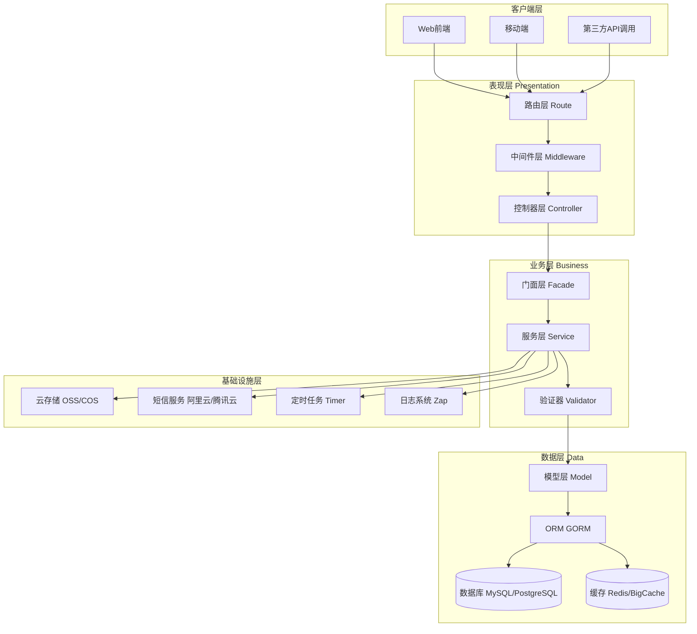
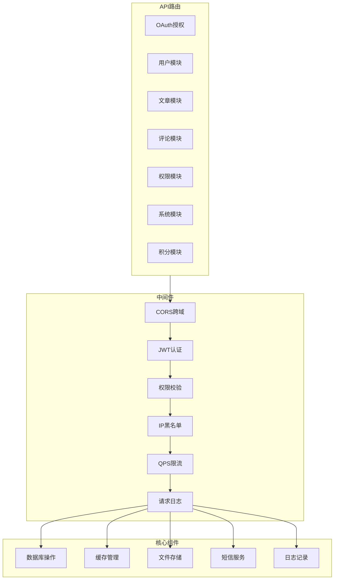

# inis

inis 是一款基于 Go 语言开发的高性能内容管理系统（CMS），基于 Gin 框架二次开发，采用 Gorm 作为数据库 ORM 工具，设计风格参考 ThinkPHP 6 的简洁架构理念。系统以 "轻量核心、高效响应、灵活扩展" 为核心定位，致力于为开发者提供易上手、具备良好扩展基础的 CMS 解决方案，同时满足企业级应用的性能与安全需求。

## 核心特性

- 🚀 **高性能**：基于 Go 语言和 Gin 框架，提供毫秒级响应能力
- 🔒 **安全可靠**：多层安全防护机制，包括安装锁、API 签名、QPS 限流、SQL 注入防护（ORM参数化查询）、XSS 防护（bluemonday HTML过滤）、CSRF 防护等
- 📦 **轻量灵活**：简洁的架构设计，易于理解和扩展
- 🌍 **国际化**：内置多语言支持，方便全球化部署
- 💾 **高效缓存**：智能缓存策略，提升数据查询效率

### 性能数据（预留）

| 指标 | 数值 | 测试环境 | 备注 |
|------|------|----------|------|
| QPS（查询接口） | - | - | 待压测 |
| QPS（写入接口） | - | - | 待压测 |
| 平均响应时间 | - | - | 待压测 |
| P99响应时间 | - | - | 待压测 |

## 快速开始
后端主程序开源仓库：[inisv1](https://github.com/zhu885744/inisv1)

### 开发环境运行
#### 步骤 1：安装依赖
1. 安装 [Go](https://golang.org/dl/) 1.25.0+ 版本（`go.mod` 声明 `go 1.25.0`）
2. 前端（`Mellow/`）需要 [Node.js](https://nodejs.org/) 20+ 与 npm 10+（仅构建主题/后台时才需要）
2. 克隆项目代码：
   ```bash
   git clone https://github.com/zhu885744/inisv1.git
   cd inisv1
   ```
3. 安装项目依赖：
   ```bash
   go mod tidy
   ```

#### 步骤 2：运行项目
```bash
go run main.go
```

> 访问地址：http://localhost:8642 —— 未安装时首页会自动 302 到图形化安装向导（`/install`），按提示完成即可
> 安装向导：检查环境 → 填写数据库 → 初始化数据 → 完成安装（装完自动解除安装锁）
> 默认管理员账号：admin
> 默认管理员密码：admin123456

### 打包教程

#### 使用 build.bat 脚本（推荐）
1. 在项目根目录下双击 `build.bat` 文件
2. 根据提示选择编译平台（Windows/Linux/macOS）
3. 询问「是否把前端（Mellow）构建产物打包进二进制？」时选 `y`（默认），
   脚本会自动 `npm install`（首次）→ `npm run build` → 把产物拷到 `theme/dist` → 带 `-tags embed` 编译
4. 等待编译完成，生成的可执行文件会放在 `dist` 目录

#### 使用 build.sh 脚本（Linux / macOS）
```bash
bash build.sh                 # 当前系统/架构，内嵌前端
bash build.sh linux amd64     # 交叉编译到 Linux x86_64
bash build.sh linux arm64     # 交叉编译到 Linux ARM64
bash build.sh linux amd64 skip  # 不构建/不内嵌前端
```

#### 单文件部署（把主题打进二进制）

选择打包前端后，编译出来的可执行文件**自带主题与安装向导**，部署只需要：

```
inis_linux_amd64     # 可执行文件（内含 Mellow 的前端产物 + 安装向导 + 语言包）
```

**连 config 目录都不用准备**：首次启动会自动创建 `config/`、`config/i18n/`、`runtime/`、`storage/` 等目录，
并用内置模板生成 `app.toml`、`cache.toml`、`log.toml`、`sms.toml`、`storage.toml`、`crypt.toml`
（`crypt.toml` 里是随机生成的 JWT 密钥，会持久化；`database.toml` 留给安装向导写），
同时把内置语言包释放到 `config/i18n/`。启动后访问首页会被 302 到 `/install` 完成安装：

```
填数据库 → 初始化数据 → 完成安装（解除安装锁）
```

> 全新部署的判定口径是「安装锁已解除 **且** database.toml 已生成」，
> 所以只拷一个二进制（既没有 install.lock、也没有 database.toml）也会被正确识别为「未安装」，
> 不会带着空数据库配置启动报错。

不必再把主题文件（`index.html`、`static/**`）分发到 `public` 目录，也不用为静态资源单独配 nginx。
运行时主题文件优先从二进制内读取，二进制里没有的（`public/assets` 的表情包与占位图、上传附件等）
照旧读磁盘；想换主题内容又不想重新编译，则不带 `-tags embed` 编译即可（与老版本行为一致）。

> 安装向导已经内置在 Mellow 里（`/install`，代码见 `Mellow/src/views/install/Index.vue`），
> 所以**全新安装也不需要额外的 install.html**：未安装时首页会自动 302 到安装向导。

> 提示：入口 HTML 与 `runtime-config.js` 会带 `no-cache`，`/static/**` 带内容 hash 的资源长缓存，
> 所以发新版不会有「用户停在旧页面 / 旧 JS」的问题。

#### 手动打包

##### Windows 平台
```bash
# 编译为可执行文件
go build -o inis.exe main.go

# 后台运行版本（无控制台窗口）
go build -ldflags -H=windowsgui -o inis.exe main.go
```

##### Linux 平台
```bash
# 编译为可执行文件
go build -o inis main.go

# 内嵌主题（单文件部署）：先把 Mellow 的构建产物放到 theme/dist，再带 embed 标签编译
cd Mellow && npm run build && cd ..
rm -rf theme/dist && mkdir -p theme/dist && cp -R Mellow/dist/. theme/dist/
go build -tags embed -o inis main.go

# 设置可执行权限
chmod +x inis
```

##### 使用 bee 工具打包
```bash
# 安装 bee 工具
go get github.com/beego/bee

# 打包为 Windows 后台运行版本
bee pack -ba="-ldflags -H=windowsgui"

# 打包为 Linux 版本
bee pack -ba="-ldflags -s -w"
```

### 服务器环境推荐
- **操作系统**：Debian 12 / Ubuntu Server 22.04 /
- **CPU**：2 核及以上
- **内存**：2GB 及以上
- **存储**：10GB SSD
- **网络**：5Mbps 及以上带宽

### 常见部署问题

| 问题 | 原因 | 解决方案 |
|------|------|----------|
| 端口被占用 | 8642 端口已被其他服务占用 | 修改 `config/app.toml` 中的端口配置 |
| 数据库连接失败 | 数据库配置错误 | 检查数据库连接信息和权限 |
| 404 错误 | 主题文件未部署 | 确保主题文件已正确部署到 `public` 目录；或打包时选「内嵌前端产物」（`go build -tags embed`），主题随二进制自带 |
| 502 错误 | 应用未运行或端口错误 | 检查应用运行状态和 Nginx 配置 |

## 系统架构

### 技术栈

> 版本以 `go.mod` 为准（下表为直接依赖 + 关键间接依赖，更新依赖后请同步本表）。

| 分类 | 技术 | 版本 | 说明 |
|------|------|------|------|
| **编程语言** | Go (Golang) | 1.25.0 | 后端服务主语言（`go.mod`：`go 1.25.0`） |
| **Web 框架** | Gin | v1.12.0 | 高性能 HTTP 请求处理框架 |
| **ORM** | GORM | v1.31.2 | 数据库 ORM 框架 |
| **数据库** | MySQL | 5.7+ / 8.x | 关系型数据库（驱动 `go-sql-driver/mysql`） |
| **数据库驱动** | go-sql-driver/mysql | v1.10.0 | 连接池：空闲 10 / 最大 100 / 复用 1h（`app/facade/mysql.go`） |
| **缓存（Redis）** | redis/go-redis | v9.21.0 | 分布式缓存驱动 |
| **缓存（本地）** | BigCache | v3.1.0 | 高性能本地内存缓存 |
| **JWT** | golang-jwt/jwt | v5.3.1 | JSON Web Token 认证 |
| **HTML 过滤** | bluemonday | v1.0.27 | 富文本 / 评论的 XSS 过滤 |
| **安全中间件** | unrolled/secure | v1.17.0 | HTTP 安全响应头 |
| **WebSocket** | gorilla/websocket | v1.5.3 | 实时通信（端点 `/socket`） |
| **HTTP/3** | quic-go（间接） | v0.61.0 | Gin 的 HTTP/3（QUIC）支持依赖 |
| **定时任务** | gocron | v0.0.1 | 定时任务调度 |
| **配置管理** | Viper | v1.21.0 | 配置文件读取（TOML） |
| **配置监听** | fsnotify | v1.10.1 | 配置文件热更新 |
| **日志框架** | Zap | v1.28.0 | 高性能结构化日志 |
| **日志轮转** | lumberjack | v2.0.0 | 按大小 / 天数切割日志（+ `lumberjack.v2` v2.2.1 间接引入） |
| **阿里云短信** | darabonba-openapi v2.2.4 / tea v1.5.3 / tea-utils v2.0.9 / openapi-util v0.1.2 | - | 阿里云短信、号码认证 |
| **腾讯云短信** | tencentcloud-sdk-go | common v1.3.146 / sms v1.3.93 | 短信发送服务 |
| **腾讯云 COS** | cos-go-sdk-v5 | v0.7.75 | 对象存储 |
| **邮件发送** | gomail | v2.0.0 | SMTP 发信（含发件队列 `app/facade/mail_queue.go`） |
| **通用工具** | go-utils | v1.3.6 | 加密 / JSON / 文件 / 字符串等常用工具 |
| **类型转换** | spf13/cast | v1.10.0 | 类型转换工具 |
| **UUID** | google/uuid | v1.6.0 | 唯一标识生成 |
| **设备指纹** | denisbrodbeck/machineid | v1.0.1 | 机器唯一标识 |
| **图片处理** | imaging | v1.6.2 | 图片裁剪、缩放、压缩 |
| **数据验证** | go-playground/validator | v10.30.3 | 请求参数验证 |
| **系统信息** | gopsutil | v3.21.11 | CPU / 内存 / 磁盘监控 |
| **GORM 插件** | gorm.io/plugin/soft_delete | v1.2.1 | 软删除支持 |
| **时间工具** | golang.org/x/time | v0.15.0 | QPS 限流等时间操作 |
| **模板引擎** | Go Template | - | 原生 `html/template`，支持服务端渲染 |

### 架构分层


```mermaid
graph TB
    subgraph 客户端层 [客户端层]
        A[Web前端]
        B[移动端]
        C[第三方API调用]
    end

    subgraph 表现层 [表现层 Presentation]
        D[路由层 Route]
        E[控制器层 Controller]
        F[中间件层 Middleware]
    end

    subgraph 业务层 [业务层 Business]
        G[门面层 Facade]
        H[服务层 Service]
        I[验证器 Validator]
    end

    subgraph 数据层 [数据层 Data]
        J[模型层 Model]
        K[ORM GORM]
        L[(数据库 MySQL/PostgreSQL)]
        M[(缓存 Redis/BigCache)]
    end

    subgraph 基础设施层 [基础设施层]
        N[云存储 OSS/COS]
        O[短信服务 阿里云/腾讯云]
        P[定时任务 Timer]
        Q[日志系统 Zap]
    end

    A --> D
    B --> D
    C --> D

    D --> F
    F --> E
    E --> G
    G --> H
    H --> I
    I --> J
    J --> K
    K --> L
    K --> M

    H --> N
    H --> O
    H --> P
    H --> Q
```


```mermaid
flowchart TD
    subgraph API路由 [API路由]
        direction LR
        A1[OAuth授权]
        A2[用户模块]
        A3[文章模块]
        A4[评论模块]
        A5[权限模块]
        A6[系统模块]
        A7[积分模块]
    end

    subgraph 中间件 [中间件]
        B1[CORS跨域]
        B2[JWT认证]
        B3[权限校验]
        B4[IP黑名单]
        B5[QPS限流]
        B6[请求日志]
    end

    subgraph 核心组件 [核心组件]
        C1[数据库操作]
        C2[缓存管理]
        C3[文件存储]
        C4[短信服务]
        C5[日志记录]
    end

    API路由 --> B1
    B1 --> B2
    B2 --> B3
    B3 --> B4
    B4 --> B5
    B5 --> B6
    B6 --> C1
    B6 --> C2
    B6 --> C3
    B6 --> C4
    B6 --> C5
```

### 核心功能

- **内容创作**：文章（Markdown 编辑器、多级分类、标签、置顶、封面、草稿 → 待审核 → 发布）、动态（图文 + 定位）、独立页面，前台带「创作中心」供作者自己管理作品
- **用户与权限**：注册（邮箱 / 手机验证码、可开关、邮箱域名白名单 / 黑名单、默认权限组）、登录（账号 / 邮箱 / 手机 + 滑块验证）、第三方登录（QQ / GitHub / Gitee，未绑定时由用户选「创建新账号」或「输入账号密码绑定已有账号」）、JWT + Cookie 双通道认证、权限组 / 权限规则 / 后台页面三级 RBAC、接口密钥（API Key）、IP 黑白名单
- **成长体系**：等级（按经验自动升级）、经验规则、积分规则、积分商城与卡密兑换、装扮（头衔 / 头像框，含佩戴记录与自定义文字）、每日签到（连签 / 周期奖励 / 里程碑 / 月全勤 / 随机奖励 / 补签）、统一奖励引擎（经验 / 积分 / 卡密 / 装扮一次发放）
- **互动与治理**：点赞、收藏、关注、评论（多级回复 + 审核）、站内通知、友链申请与分组审核、内容 / 评论 / 友链 / 注册四类审核、封禁与申诉（小黑屋公示）、用户隐私分级（字段可见性）、操作日志脱敏
- **媒体与存储**：静态图片按 URL 参数实时处理（`?size=100x100&mode=fill|resize|fit`，支持 jpg / png / gif / tiff / bmp 输出并带内存缓存）、表情包与附件库、本地存储与腾讯云 COS（目录 / 文件命名规则可配，含上传大小、并发与扩展名白名单校验）
- **消息通道**：邮件通知（场景开关 + 发件队列：分批限流、失败重试）、短信（阿里云短信 / 阿里云号码认证 / 腾讯云短信）、WebSocket 实时推送（`/socket`）
- **系统与运维**：图形化安装向导（安装锁）、系统设置（分组导航：内容 / 评论 / 存储 / 缓存 / 短信 / 邮件 / 注册 / 账号安全 / JWT / 分页 / 通知）、缓存三驱动（本地 / 文件 / Redis，支持按标签批量清理）、QPS 限流与超限告警、定时任务（封禁到期、装扮到期、日志清理、通知清理）、多语言（中 / 英 / 韩 / 俄）、RSS 与站内搜索
- **部署友好**：前端产物可用 `-tags embed` 内嵌进单个二进制，运行时只需「二进制 + config 目录」

### 功能模块

#### 1. 前台（`MainLayout`）
- 首页：公告（多条自动轮播 + 详情弹窗）、文章列表，侧栏含最新评论与随机文章
- 文章：列表 / 详情 / 归档 / 分类 / 标签（多级分类、标签聚合）
- 动态：图文动态（含位置）与详情、点赞、评论
- 搜索：按范围检索（`/search?q=&scope=`）
- 友链：分组展示、在线申请、申请进度查询
- 商城：积分兑换商品（装扮类）与卡密兑换
- 每日签到：签到日历、连签、补签、奖励预览
- 独立页面与协议：`/about` 等自定义页面、用户协议、隐私协议
- 用户主页：`/author/:id`（资料、作品、关注与粉丝）
- 小黑屋：封禁公示页（`/blackroom`）

#### 2. 用户中心（`/user`）
- 个人资料（`/user/profile`）、隐私设置（`/user/settings`）、联系方式（`/user/contact`）
- 账号安全（`/user/security`）：重置密码、第三方账号绑定 / 解绑、账号注销、安全提示
- 我的奖励（`/user/reward`）：经验 / 积分 / 卡密等奖励明细
- 等级与经验（`/user/exp`）、我的积分（`/user/integral`）
- 我的装扮（`/user/decorations`）：佩戴 / 卸下头衔与头像框、自定义头衔文字
- 消息通知（`/user/notifications`）：站内信、未读计数、一键跳转对应内容

#### 3. 创作中心（`/manage`）
- 数据概览、我的文章（草稿 / 待审核 / 已发布 / 编辑）、我的动态、我的友链

#### 4. 后台（`/admin`）
- 概览：站点内容、用户与互动统计
- 内容：文章与分类、独立页面、动态、评论、公告、轮播（位图素材管理）、标签、附件
- 用户：用户管理（资料、状态、封禁与申诉、经验 / 积分调整）、消息通知
- 成长：等级、经验、积分、商品（商城）、装扮、签到
- 互动：友链与友链分组
- 系统：系统设置（分组导航）、缓存 / 存储 / 短信 / 邮件 / 注册 / 安全 / JWT / 分页 / 通知
- 安全：权限规则、权限组、后台页面、接口密钥、IP 黑白名单、QPS 预警

#### 5. 后端基础设施
- 安装向导（`/install`）与安装锁（`install.lock`）
- 多驱动适配：缓存（本地 / 文件 / Redis）、存储（本地 / 腾讯云 COS）、短信（阿里云 / 阿里云号码认证 / 腾讯云）、邮件（SMTP + 发件队列）
- 审核体系：内容 / 评论 / 友链 / 注册人工审核 + 封禁申诉流程
- 实时通信：WebSocket（`/socket`，在线状态与消息推送）
- 定时任务：封禁到期解封、装扮到期、日志清理、通知清理
- 多语言：中 / 英 / 韩 / 俄（由 `i18n-assets.go` 内嵌）
- 接口文档：`docs/API docs/` 共 38 篇，覆盖全部模块

## 配置说明

### 配置文件
配置文件位于 `config` 目录下，首次启动时按 `app/facade/template.go` 里的模板自动生成（含密钥，已在 `.gitignore` 中排除）：

共 7 个配置文件：

| 文件 | 说明 |
|------|------|
| `app.toml` | 应用端口（默认 8642）、调试开关、token 名、socket、通知等 |
| `cache.toml` | 缓存驱动（local / file / redis）与过期时间 |
| `crypt.toml` | JWT 签名密钥（`jwt.key` 首次随机生成后持久化，删除会导致所有已登录用户 token 失效） |
| `log.toml` | 日志级别、保留天数与轮转策略 |
| `sms.toml` | 短信 / 邮件驱动（阿里云短信、阿里云号码认证、腾讯云短信、SMTP）与发件队列 |
| `storage.toml` | 存储驱动（本地 / 腾讯云 COS）、上传限制与路径命名规则 |
| `database.toml` | 数据库连接信息（由安装向导第一步写入） |

生成时机：`app.toml`、`cache.toml`、`log.toml`、`sms.toml`、`storage.toml` 在首次启动时按模板自动生成（`app/facade/bootstrap.go`）；`crypt.toml` 由 `app/facade/crypt.go` 自己读写；`database.toml` 由安装向导写入 —— 后两个刻意不在启动时预生成。

`app.go` 负责读取上述配置并启动服务；`i18n/` 为语言包（中文 / 英语 / 韩语 / 俄语），由 `i18n-assets.go` 内嵌进二进制。

### 版本管理
后端版本号定义在 `app/facade/const.go`（`Version`，当前 `1.0.0`）。该文件里还有设备签名盐值 `DefaultToken`，可用环境变量 `INIS_DEVICE_TOKEN` 覆盖。

### API 接口文档
本文档详细标注了如何在开发主题中使用自定义接口。

## 目录结构

```
inisv1/
├── .gitignore              # Git 忽略配置
├── LICENSE                 # 项目许可证（Apache-2.0）
├── README.md               # 项目说明文档（本文件）
├── main.go                 # 程序入口
├── go.mod / go.sum         # Go 模块与依赖、依赖校验文件（版本见「系统架构 → 技术栈」）
├── build.bat               # 编译脚本（Windows；可把前端产物一起打进二进制）
├── build.sh                # 编译脚本（Linux / macOS，同样支持内嵌前端）
├── install.sh              # Linux / macOS 安装脚本
├── install.lock            # 安装锁（存在表示尚未完成安装，装完自动解除）
│
├── config/                 # 配置目录（含密钥等敏感信息，已在 .gitignore 排除）
│   ├── app.toml            # 应用配置：端口(8642)、调试、token 名、socket、通知等（启动时按模板生成）
│   ├── cache.toml          # 缓存驱动 local / file / redis（启动时生成）
│   ├── crypt.toml          # JWT 密钥（jwt.key 首次随机生成并持久化，丢失会导致全员 token 失效）
│   ├── log.toml            # 日志级别、保留天数与轮转（启动时生成）
│   ├── sms.toml            # 短信 / 邮件驱动与发件队列（启动时生成）
│   ├── storage.toml        # 存储驱动、上传限制与路径命名规则（启动时生成）
│   ├── database.toml       # 数据库连接（由安装向导写入，启动时不预生成）
│   ├── app.go              # 配置加载与服务启动（读取 app.toml、监听端口）
│   ├── i18n-assets.go      # 语言包内嵌（go:embed）
│   └── i18n/               # 国际化语言包：zh-cn / en-us / ko-kr / ru-ru
│
├── docs/                   # 文档（42 篇）
│   ├── API docs/           # 接口文档（38 篇，按模块划分）
│   │   ├── api-keys.md                 # 接口密钥
│   │   ├── article-group.md            # 文章分组
│   │   ├── article.md                  # 文章
│   │   ├── attachment.md               # 附件
│   │   ├── auth-group.md               # 权限分组
│   │   ├── auth-pages.md               # 后台页面
│   │   ├── auth-rules.md               # 权限规则
│   │   ├── banner.md                   # 轮播图
│   │   ├── base.md                     # 基础接口
│   │   ├── checkin.md                  # 每日签到
│   │   ├── comm.md                     # 通用（验证码、统计等）
│   │   ├── comment.md                  # 评论
│   │   ├── config.md                   # 系统配置
│   │   ├── exp.md                      # 经验值
│   │   ├── file.md                     # 文件上传
│   │   ├── goods.md                    # 商品 / 装扮商城
│   │   ├── integral.md                 # 积分
│   │   ├── ip-black.md                 # IP 黑名单
│   │   ├── ip-white.md                 # IP 白名单
│   │   ├── level.md                    # 等级
│   │   ├── links-group.md              # 友链分组
│   │   ├── links.md                    # 友链
│   │   ├── moments.md                  # 动态
│   │   ├── notification.md             # 站内通知
│   │   ├── oauth.md                    # 第三方登录
│   │   ├── pages.md                    # 独立页面
│   │   ├── placard.md                  # 公告
│   │   ├── proxy.md                    # 代理
│   │   ├── qps-warn.md                 # QPS 预警
│   │   ├── rss.md                      # RSS 订阅
│   │   ├── search.md                   # 搜索
│   │   ├── tags.md                     # 标签
│   │   ├── toml.md                     # TOML 配置读写
│   │   ├── user-collects.md            # 用户收藏
│   │   ├── user-follows.md             # 用户关注
│   │   ├── user-interaction-guide.md   # 用户互动模块前端调用指南
│   │   ├── user-likes.md               # 用户点赞
│   │   └── users.md                    # 用户
│   ├── cache.md                        # 缓存机制说明
│   ├── database-index.md               # 数据库索引说明
│   ├── 二次开发规范.md                  # 二次开发规范
│   └── 前端主题开发及API调用规范.md      # 前端主题开发及 API 调用规范
│
├── public/                 # 静态资源目录：表情包等后端资源 + 主题产物的默认部署位置
│   │                       # （非内嵌构建时把 Mellow 构建产物拷进来：index.html、static/*）
│   └── assets/
│       └── emoji/          # 表情包资源（按来源分目录，gif / png / webp）
│
├── theme/                  # 内嵌主题产物（-tags embed 时打进二进制）
│   ├── theme.go            # 内嵌主题的查找与响应元信息（默认构建为空实现）
│   ├── theme_embed.go      # //go:embed all:dist（仅在 -tags embed 时编译）
│   └── dist/               # 前端构建产物：cp -R Mellow/dist/. theme/dist/
│
└── app/                    # 后端核心业务代码（161 个 .go）
    │
    ├── api/                # 接口层（控制器 / 中间件 / 路由）
    │   ├── controller/     # 控制器（40）
    │   │   ├── OAuth.go            # 第三方登录
    │   │   ├── api-keys.go         # 接口密钥管理
    │   │   ├── article-group.go    # 文章分组
    │   │   ├── article.go          # 文章
    │   │   ├── attachment.go       # 附件管理
    │   │   ├── audit.go            # 内容审核（文章 / 动态 / 页面共用）
    │   │   ├── auth-group.go       # 权限分组
    │   │   ├── auth-pages.go       # 后台页面
    │   │   ├── auth-rules.go       # 权限规则
    │   │   ├── banner.go           # 轮播图
    │   │   ├── base.go             # 基础控制器（公共方法封装）
    │   │   ├── checkin.go          # 每日签到
    │   │   ├── comm.go             # 通用接口（验证码、统计等）
    │   │   ├── comment.go          # 评论
    │   │   ├── config.go           # 系统配置
    │   │   ├── decoration.go       # 装扮（头衔 / 头像框）
    │   │   ├── exp.go              # 经验值
    │   │   ├── goods.go            # 商品（装扮商城）
    │   │   ├── integral.go         # 积分
    │   │   ├── ip-black.go         # IP 黑名单
    │   │   ├── ip-white.go         # IP 白名单
    │   │   ├── level.go            # 等级
    │   │   ├── links-group.go      # 友链分组
    │   │   ├── links.go            # 友链
    │   │   ├── mail-notify.go      # 邮件通知
    │   │   ├── moments.go          # 动态
    │   │   ├── notification.go     # 站内通知
    │   │   ├── pages.go            # 独立页面
    │   │   ├── placard.go          # 公告
    │   │   ├── privacy.go          # 用户隐私分级（字段可见性）
    │   │   ├── proxy.go            # 代理
    │   │   ├── qps-warn.go         # QPS 预警
    │   │   ├── rss.go              # RSS 订阅
    │   │   ├── search.go           # 搜索
    │   │   ├── tags.go             # 标签
    │   │   ├── toml.go             # TOML 配置读写（后台配置页）
    │   │   ├── user-collects.go    # 用户收藏
    │   │   ├── user-follows.go     # 用户关注
    │   │   ├── user-likes.go       # 用户点赞
    │   │   └── users.go            # 用户
    │   ├── middleware/     # 接口中间件（8）
    │   │   ├── api-key.go          # 接口密钥校验
    │   │   ├── captcha.go          # 滑块验证
    │   │   ├── file_limit.go       # 上传体积限制（默认 50MB）
    │   │   ├── ip-black.go         # IP 黑名单拦截
    │   │   ├── jwt.go              # JWT 认证
    │   │   ├── method.go           # 请求方法校验
    │   │   ├── restriction.go      # 路由访问限制（封禁 / 禁言等）
    │   │   └── rule.go             # 权限规则校验
    │   └── route/
    │       └── app.go              # 接口路由注册
    │
    ├── dev/                # 安装引导与系统信息
    │   ├── controller/
    │   │   ├── base.go             # 开发基础控制器
    │   │   ├── info.go             # 系统信息（环境检测）
    │   │   └── install.go          # 安装向导
    │   └── route/
    │       └── app.go              # 开发路由注册（含仅本机可访问的运维接口）
    │
    ├── facade/             # 门面层（封装核心服务与工具，17）
    │   ├── app.go                  # 应用服务封装（启动、关闭等）
    │   ├── bootstrap.go            # 首次启动引导（建目录、按模板生成 config/*.toml）
    │   ├── cache.go                # 缓存服务（local / file / redis）
    │   ├── comm.go                 # 通用工具（XSS 检测、HTML 过滤、IP 归属等）
    │   ├── const.go                # 版本号等常量
    │   ├── crypt.go                # 加密解密（AES / RSA / Hash）
    │   ├── db.go                   # 数据库服务（Facade 模式）
    │   ├── lang.go                 # 多语言
    │   ├── log.go                  # 日志服务
    │   ├── mail_queue.go           # 邮件发件队列（分批投递、失败重试）
    │   ├── mysql.go                # MySQL 连接与连接池、常用查询封装
    │   ├── sms.go                  # 短信 / 邮件驱动（阿里云、腾讯云、SMTP）
    │   ├── storage-rule.go         # 上传路径 / 文件名规则（占位符解析）
    │   ├── storage.go              # 存储服务（本地 / 腾讯云 COS）
    │   ├── template.go             # 各 .toml 配置模板
    │   ├── toml.go                 # TOML 配置读取
    │   └── var.go                  # 全局变量
    │
    ├── index/              # 前台首页
    │   ├── controller/
    │   │   └── index.go            # 首页 / SPA 主题路由回退
    │   └── route/
    │       └── app.go              # 首页路由注册
    │
    ├── middleware/         # 全局中间件（10）
    │   ├── cors.go                 # 跨域 CORS
    │   ├── install.go              # 安装检测（未安装时 302 到向导）
    │   ├── ip.go                   # IP 访问控制
    │   ├── local.go                # 仅本机访问（保护 /dev 运维接口）
    │   ├── log.go                  # 请求日志
    │   ├── params.go               # 参数解析
    │   ├── qps.go                  # QPS 限流
    │   ├── redact.go               # 日志敏感信息脱敏
    │   ├── tls.go                  # TLS / HTTPS
    │   └── token.go                # Token 校验
    │
    ├── model/              # 数据模型与业务逻辑（42）
    │   ├── api-keys.go             # 接口密钥
    │   ├── article-group.go        # 文章分组
    │   ├── article.go              # 文章
    │   ├── attachment.go           # 附件
    │   ├── auth-group.go           # 权限分组
    │   ├── auth-pages.go           # 后台页面（侧栏菜单来源）
    │   ├── auth-rules.go           # 权限规则（接口权限点）
    │   ├── banner.go               # 轮播图
    │   ├── base.go                 # 基础模型（公共方法、建表与初始数据）
    │   ├── captcha-config.go       # 滑块验证配置
    │   ├── captcha.go              # 滑块验证（生成与校验）
    │   ├── checkin.go              # 每日签到（含签到规则）
    │   ├── comment.go              # 评论
    │   ├── config.go               # 系统配置（config 表，含启动迁移）
    │   ├── decoration.go           # 装扮（头衔 / 头像框，佩戴状态同步到 users.title）
    │   ├── exp.go                  # 经验值
    │   ├── goods.go                # 商品（装扮商城）
    │   ├── integral-card.go        # 积分卡密
    │   ├── integral.go             # 积分
    │   ├── ip-black.go             # IP 黑名单
    │   ├── ip-white.go             # IP 白名单
    │   ├── level.go                # 等级
    │   ├── links-group.go          # 友链分组
    │   ├── links.go                # 友链
    │   ├── mail-notify.go          # 邮件通知场景（开关与模板）
    │   ├── moments.go              # 动态
    │   ├── notification.go         # 站内通知
    │   ├── oauth.go                # 第三方登录（QQ / GitHub / Gitee）
    │   ├── pages.go                # 独立页面
    │   ├── placard.go              # 公告
    │   ├── privacy.go              # 用户隐私分级（字段可见性）
    │   ├── qps-warn.go             # QPS 预警
    │   ├── register.go             # 注册策略（验证方式、域名限制、默认权限组）
    │   ├── reward-card-stock.go    # 奖励卡密库存
    │   ├── reward-card.go          # 奖励卡密
    │   ├── reward.go               # 奖励引擎（经验 / 积分 / 卡密 / 装扮统一发放）
    │   ├── tags.go                 # 标签
    │   ├── user-collects.go        # 用户收藏
    │   ├── user-follows.go         # 用户关注
    │   ├── user-likes.go           # 用户点赞
    │   ├── users.go                # 用户
    │   └── user_ban_records.go     # 封禁记录与申诉
    │
    ├── socket/             # WebSocket 实时通信（端点 /socket）
    │   ├── controller/
    │   │   ├── base.go             # 基础控制器
    │   │   ├── index.go            # 连接与消息主逻辑
    │   │   ├── online.go           # 在线用户管理
    │   │   ├── serialize.go        # 消息序列化
    │   │   └── status.go           # 连接状态
    │   ├── middleware/
    │   │   └── app.go              # WebSocket 握手中间件
    │   └── route/
    │       └── app.go              # WebSocket 路由注册
    │
    ├── timer/              # 定时任务（6）
    │   ├── ban.go                  # 封禁到期自动解封
    │   ├── decoration.go           # 装扮到期处理
    │   ├── device.go               # 设备信息
    │   ├── log.go                  # 日志清理
    │   ├── notification.go         # 通知清理
    │   └── run.go                  # 定时任务入口
    │
    └── validator/          # 请求参数校验（24）
        ├── api-keys.go             # 接口密钥
        ├── article-group.go        # 文章分组
        ├── article.go              # 文章
        ├── attachment.go           # 附件
        ├── auth-group.go           # 权限分组
        ├── auth-pages.go           # 后台页面
        ├── auth-rules.go           # 权限规则
        ├── banner.go               # 轮播图
        ├── base.go                 # 基础校验（公共规则封装）
        ├── comment.go              # 评论
        ├── config.go               # 系统配置
        ├── exp.go                  # 经验值
        ├── ip-black.go             # IP 黑名单
        ├── ip-white.go             # IP 白名单
        ├── level.go                # 等级
        ├── links-group.go          # 友链分组
        ├── links.go                # 友链
        ├── notification.go         # 站内通知
        ├── pages.go                # 独立页面
        ├── placard.go              # 公告
        ├── qps-warn.go             # QPS 预警
        ├── tags.go                 # 标签
        ├── user_ban_records.go     # 封禁记录
        └── users.go                # 用户
```

## 开发指南

### 代码规范
- 遵循 Go 语言官方代码规范
- 使用 `gofmt` 格式化代码
- 保持函数简洁，单一职责原则
- 必须合理使用注释说明函数、结构体、变量等，避免使用默认值或隐含逻辑，以及每段代码的作用

### 添加新功能
1. 在 `app/model/` 创建数据模型
2. 在 `app/api/controller/` 创建控制器
3. 在 `app/api/route/` 注册路由
4. 在 `app/validator/` 添加验证器（如需要）
5. 在 `app/api/service/` 创建服务层（如需要）
6. 在 `app/model/auth-rules.go` 添加权限规则（如需要）
7. 在 `app/model/auth-pages.go` 添加页面权限（如需要）
8. 数据库创建需要在`app/model/base.go`注册 初始化数据表
9. 编写单元测试（如需要）

### 文档规范
- 所有接口必须有详细的文档说明，包括请求参数、响应参数、错误码等
- 文档必须与代码保持同步，避免文档与代码不一致

### 数据库迁移
系统使用 Gorm 的 AutoMigrate 功能自动管理数据库结构，确保模型定义正确即可。

## 常见问题

### Q: 如何修改默认端口？
A: 在 `config/app.toml` 中修改端口配置。

### Q: 如何切换数据库？
A: 修改数据库配置文件，并确保安装了对应的数据库驱动。

### Q: 如何启用缓存？
A: 在配置文件中设置缓存相关参数，支持文件缓存、内存缓存和 Redis 缓存。

## 贡献指南

欢迎提交 Issue 和 Pull Request 来帮助改进项目！

## 许可证

本项目采用 [Apache-2.0 license](LICENSE) 许可证。

## 联系方式

如有问题或建议，请通过以下方式联系：
- GitHub Issues
- 交流群：119300889
- 邮箱：xz@zhuxu.asia

## 致谢
原作者「陈兔子」：[https://github.com/racns](https://github.com/racns)<br>
原开源仓库「已停更」：[https://github.com/inis-io/inis](https://github.com/inis-io/inis)<br>
感谢所有为开源社区做出贡献的开发者！

### 开源许可
[](https://opensource.org/licenses/Apache-2.0)